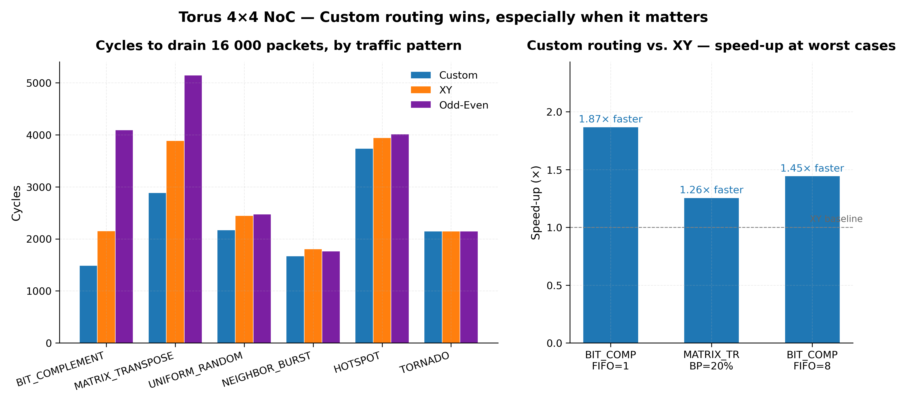

# Torus 4×4 NoC — Routing Algorithm Comparison

A SystemVerilog 4×4 torus Network-on-Chip with three switchable routing
algorithms (XY, Odd-Even, Custom torus-aware), benchmarked across **345
Vivado simulations** spanning six traffic patterns, five backpressure
levels, and seven FIFO depths.



**Headline findings.** Custom torus-aware routing beats mesh-style XY by
13–87% on adversarial patterns. The classical Odd-Even turn model, used
deterministically, is the *worst* of the three on this topology — see
[docs/results.md](docs/results.md#findings--analysis--2026-05-27) for why
(it's about head-of-line blocking, not hop count).

> Built during my AMD hardware-engineering internship — assigned as an open-
> ended exploration of routing-algorithm tradeoffs on a 4×4 torus NoC.
> All RTL, automation, experiments, and analysis are in this repo.

---

## Layout

```
final/
├── src/                                  # Design SystemVerilog
│   ├── router_fifo.sv                    #   Single router: skid buffer + FIFO + XY/OE/Custom routing
│   ├── torus_4x4.sv                      #   4×4 torus wrapper, exposes FIFO_DEPTH parameter
│   ├── torus_topology.sv                 #   Alternative manually-wired topology
│   ├── crossbar_16x16.sv                 #   16×16 crossbar reference
│   ├── vc_router*.sv                     #   Virtual-channel router variants
│   ├── router.sv                         #   Pre-FIFO baseline (skid buffer only)
│   ├── router_fifo.sv.golden             #   Snapshot used by switch_routing.sh
│   └── tb/                               # Testbenches
│       ├── tb_torus_large.sv             #   Exp 1 driver (random traffic, prints CYCLES)
│       ├── tb_different_workload.sv      #   Exp 2+ driver (6 patterns, configurable BP, latency stats)
│       └── tb_*.sv                       #   Misc directed / single-router TBs
├── scripts/                              # Experiment automation (every .sh sources _env.sh)
│   ├── _env.sh                           #   Single source of truth for paths
│   ├── switch_routing.sh                 #   Activate {custom|xy|oddeven} in router_fifo.sv
│   ├── switch_workload.sh                #   Patch traffic-pattern / BP / hotspot / pkts
│   ├── run_one_workload.sh               #   Single workload sim (cycles + avg/min/max latency)
│   ├── run_exp1_sweep.sh                 #   Exp1 — FIFO depth sweep
│   ├── run_exp_all.sh                    #   Exp2-5 — workload variants
│   ├── run_exp6_heavybp.sh               #   Exp6 — heavy BP stress
│   ├── run_exp7_fifo1.sh                 #   Exp7 — minimum-buffer FIFO=1
│   ├── run_exp8_2d_heatmap.sh            #   Exp8 — BP × HOTSPOT 2D heatmap
│   ├── run_exp9_fifo_heavyload.sh        #   Exp9 — FIFO sweep at BP=30%
│   ├── run_exp10_full_matrix.sh          #   Exp10 — full pattern × FIFO matrix
│   ├── run_exp11_load_scaling.sh         #   Exp11 — PKTS_PER_SRC sweep
│   ├── run_exp3_rerun.sh                 #   Targeted Exp3 re-runner
│   ├── run_exp_extras.sh                 #   Master for Exp6-11
│   └── run_full_rerun.sh                 #   Master for Exp1-11
├── tcl/
│   ├── create_project.tcl                #   Regenerates the Vivado .xpr
│   └── exp1_fifo_sweep.tcl               #   Standalone reference TCL
├── docs/
│   ├── results.md                        #   Append-only result tables + Findings analysis
│   ├── results_workload.csv              #   Same data, machine-readable
│   └── vivado_automation_commands.md     #   Teaching reference for the flow
├── notebooks/
│   ├── report_plots.ipynb                #   Generates every figure from the CSV
│   └── figures/                          #   11 PNGs at 300 dpi
├── claude_stratchpad_workpsace/
│   ├── session_log.md                    #   Timestamped, append-only automation log
│   ├── tcl/   logs/                      #   10 representative samples (full trove via rerun)
│   └── scripts/                          #   build_notebook.py, exec_notebook.py
├── CHANGELOG.md
└── README.md                             # this file
```

---

## Quick start

The `scripts/_env.sh` file is the only place paths live. Edit the USER
CONFIG block at the top of `_env.sh` (Vivado binary, projects dir, project
name) or override at the command line:

```bash
cd <path-to>/final
source scripts/_env.sh

# 1. Rebuild the Vivado project (one-time)
"$VIVADO" -mode batch -source "$TCL_DIR/create_project.tcl"

# 2. Run a single workload sim
bash scripts/switch_routing.sh custom            # active algo: custom | xy | oddeven
bash scripts/run_one_workload.sh Custom UNIFORM_RANDOM 70 10 8 60000
#                                ^ALGO ^PATTERN ^BP_READY% ^BP_HOTSPOT% ^FIFO ^SIM_NS

# 3. Run all 345 simulations end-to-end (~2.5 hours wall)
bash scripts/run_full_rerun.sh
```

Every script appends to `docs/results.md` (markdown table) AND
`docs/results_workload.csv` (raw rows for plotting). Source files are
restored to baseline on every script exit via `trap cleanup EXIT INT TERM`.

To regenerate the figures from the CSV:

```bash
conda activate mlfw_research   # or any env with pandas + matplotlib
python claude_stratchpad_workpsace/scripts/build_notebook.py
python claude_stratchpad_workpsace/scripts/exec_notebook.py
```

---

## Routing algorithms

`router_fifo.sv` defines three `always_comb` blocks inside `xy_route_logic`:

| Algorithm | Lines    | What it does                                                                                  |
|-----------|----------|-----------------------------------------------------------------------------------------------|
| XY        | 31–42    | Mesh dimension-order: route X first, then Y.                                                  |
| Odd-Even  | 47–93    | Glass & Ni (1993) deterministic odd-even turn model — restricts turns by column parity.       |
| Custom    | 99–125   | Torus-aware modular routing: `(dst−src) mod 4` picks the shorter wrap direction.              |

`switch_routing.sh` selects one by commenting / uncommenting the right
block. Exactly one `always_comb` must be active at all times (the script
verifies).

---

## Parameter knobs

| Knob              | Where                                  | How to set                               |
|-------------------|----------------------------------------|------------------------------------------|
| `FIFO_DEPTH`      | `src/torus_4x4.sv:22`                  | sed by `run_one_workload.sh` (5th arg)   |
| `TRAFFIC_PATTERN` | `src/tb/tb_different_workload.sv:40`   | `scripts/switch_workload.sh` arg 1       |
| `BP_READY_PERCENT`| line 42                                | arg 2                                    |
| `BP_HOTSPOT_PCT`  | line 43                                | arg 3                                    |
| `PKTS_PER_SRC`    | line 27                                | arg 4 (optional; default = golden value) |
| Sim duration      | TCL `run Xns`                          | `run_one_workload.sh` arg 6 (SIM_NS)     |

---

## License

MIT — see `LICENSE`.
